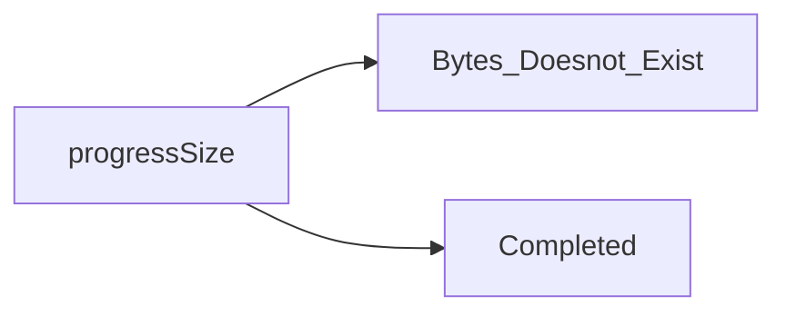

>[!Note]
>In the download item, the component maintains a `state`, which can be of 'progressing' | 'paused' | 'completed' | 'cancelled' | 'interrupted'

## Getting the progress Size : 
---

- On the state Completed, our goal is to show the total byte size, i18n.format, formates the first argument using the second argument as format (the formats are defined by the programmer in [[Common.ts]]).
 ![[Pasted image 20220813204226.png|450x100]]
 - This particular function returns : 
 ![[Pasted image 20220813204523.png|500x150]]
 This means that, the first argument is used as the key and in the key you can give some parameters which will be injected inside the string key, taken from the second argument object. Refer the below example.

![[Pasted image 20220813203818.png|550x150]]![[Pasted image 20220813203902.png|550x150]]

## Getting the progress Speed && Estimated Time Left : 
---
- It is memoized function.
- If *recievedBytes*, *totalBytes*, *startTime*, *entime* doesnot exist or the current state is not progressing 
	- return `undefined`.
- Else
	- return `bytespeed` or `duration`, defined in [[Common.ts]]

## Handle State function  ( Renderer ) :

- HandlePause/Resume/Cancel.... functions are very similar, the basic functionality is to invoke an event of the ipcRenderer and passes the itemID as data.
- The invoked events are handled by `setupDownloads` function which is called when the app starts, in [[main.ts]].